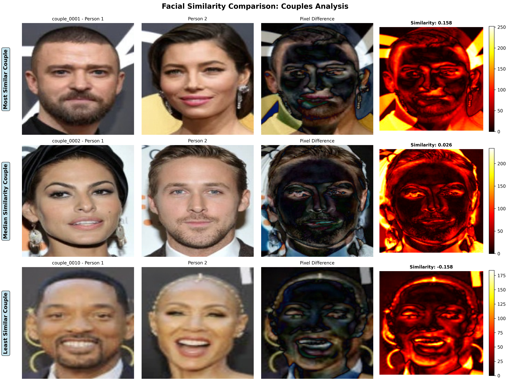

# Do We Date Alike?
### A Data-Driven Analysis of Facial Similarity in Romantic Couples

## Overview

This project investigates the fascinating question: **Do people date partners who look like them?** Using computer vision, facial recognition technology, and statistical analysis, we analyze facial similarity between romantic partners to uncover patterns in human attraction.

## Research Question

Are romantic partners more facially similar to each other than random pairs of people?

## Methodology

1. **Data Collection**: Gather images of confirmed romantic couples from publicly available sources
2. **Face Detection & Extraction**: Use state-of-the-art face detection to isolate faces
3. **Feature Extraction**: Extract facial embeddings using deep learning models (FaceNet/VGGFace)
4. **Similarity Measurement**: Calculate cosine similarity between partner embeddings
5. **Statistical Testing**: Compare couple similarity scores against random pair baselines
6. **Visualization**: Generate compelling visualizations of findings

## Project Structure

```
.
├── data/
│   ├── raw/              # Original couple images
│   └── processed/        # Extracted faces and embeddings
├── src/
│   ├── data_collection/  # Scripts for gathering couple images
│   ├── facial_analysis/  # Face detection and embedding extraction
│   ├── statistical_analysis/  # Statistical tests and analysis
│   └── visualization/    # Plotting and result visualization
├── notebooks/            # Jupyter notebooks for exploration
├── results/              # Generated plots, statistics, and findings
├── tests/                # Unit tests
└── blog_post.md         # Final blog post with findings
```

## Technologies Used

- **Computer Vision**: OpenCV, dlib, MTCNN
- **Deep Learning**: TensorFlow/PyTorch, FaceNet, VGGFace2
- **Data Analysis**: NumPy, Pandas, SciPy
- **Visualization**: Matplotlib, Seaborn, Plotly
- **Statistical Analysis**: SciPy, statsmodels

## Key Metrics

- **Facial Similarity Score**: Cosine similarity between facial embeddings (0-1)
- **Statistical Significance**: p-values from t-tests and permutation tests
- **Effect Size**: Cohen's d to measure practical significance

## Installation

```bash
# Clone the repository
git clone https://github.com/yourusername/do-we-date-alike.git
cd do-we-date-alike

# Create virtual environment
python -m venv venv
source venv/bin/activate  # On Windows: venv\Scripts\activate

# Install dependencies
pip install -r requirements.txt
```

## Quick Start

### Easy Way (Recommended!)

```bash
# 1. Add couple photos (auto-extracts 2 faces from each photo!)
python add_couple_photos.py path/to/couple_photo.jpg
# OR add entire folder:
python add_couple_photos.py path/to/couples_folder/

# 2. Run complete pipeline
python run_pipeline.py

# 3. Check results in results/
```

### Step-by-Step

```bash
# 1. Add data
python add_couple_photos.py my_photos/  # NEW: Auto-extracts faces!

# 2. Extract facial embeddings
python src/facial_analysis/extract_embeddings.py

# 3. Run statistical analysis
python src/statistical_analysis/analyze_similarity.py

# 4. Generate visualizations
python src/visualization/create_plots.py
```

**NEW Feature**: Automatically extract 2 faces from photos containing both people! No need to manually crop. See [HOW_TO_ADD_PHOTOS.md](HOW_TO_ADD_PHOTOS.md) for details.

## Ethical Considerations

- All images used are from publicly available sources
- No personal identifying information is stored
- Research is conducted for educational and scientific purposes
- Findings are presented with appropriate statistical caveats

## Results

p-value for non celebrity couples = 0.35
p-value for celebrity couples = 0.0025

Therefore, celebrity couples tend to end up dating someone more similar looking to them.



## Future Work

- Expand dataset size and diversity
- Control for demographic factors (age, ethnicity, etc.)
- Investigate personality similarity alongside facial similarity
- Explore temporal aspects (do couples grow more similar over time?)

## Author

Sinclair Lim

## License

MIT License

## References

- Schroff, F., Kalinichenko, D., & Philbin, J. (2015). FaceNet: A unified embedding for face recognition and clustering.
- Zajonc, R. B., et al. (1987). Convergence in the physical appearance of spouses.
